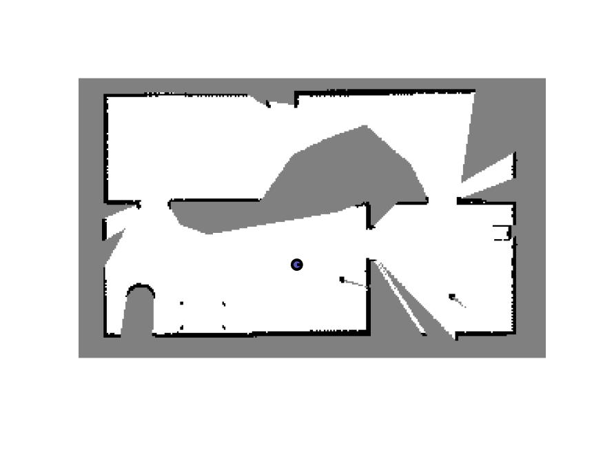
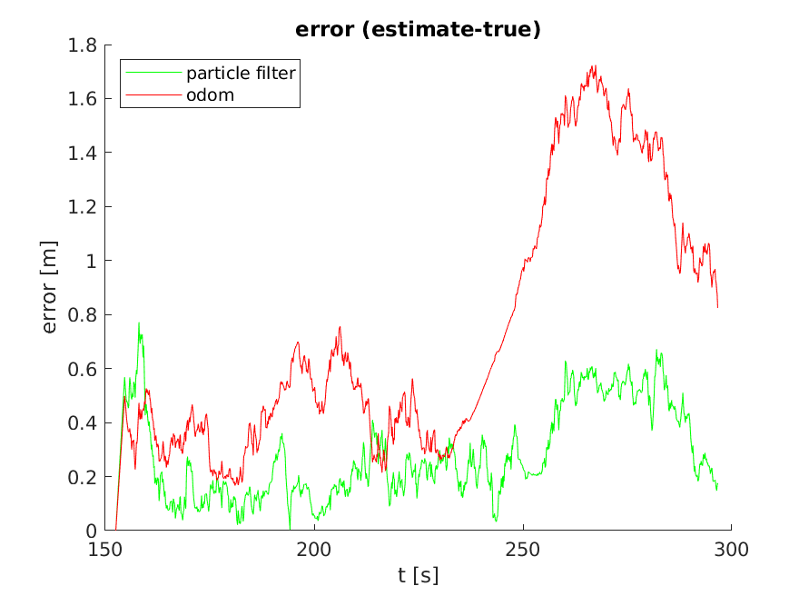

In this project, two algorithms are applied to a MATLAB simulation of a mobile robot. Using the robot's sensor measurements and odometry measurements, an occupancy grid was constructed for the purpose of mapping. Also, a particle filter was designed to estimate the location of the mobile robot at each time step. 

To observe the occupancy grid and particle filter algorithms in action, download the results folder. This folder contains error plots as well as .avi files that illustrate the evolution of these two algorithms. 

## Occupancy Grid Mapping:
The mobile robot yields laser scan information, the mobile robot’s location in an inertial frame, and the mobile robot’s orientation. To accomplish the task of constructing an occupancy grid, a simple algorithm was designed. At each time step, a transformation matrix that transforms points from the robot’s frame into the inertial frame is constructed. Then, each laser in the scan corresponding to the current time step is iterated over. The points at the end of each laser are indicative of obstacles. As such, the point at the end of the laser being analyzed is translated into coordinates and increases the likelihood that that particular map entry is occupied. Each subsequent point prior to the end of the laser is also translated into coordinates. These points increase the probability that those particular squares are unoccupied. After every laser is iterated over, the map is thresholded. Squares that are more likely to be occupied are marked as occupied and squares that are more likely to be unoccupied are marked as unoccupied. Figure 1, below, is the result produced for this section:

*Figure 1: Resultant occupancy grid*

Measurements in which the angular velocity was greater than 0.1 were ignored. Given the limited range of the sensor measurements and the robot’s ignorance, the above Figure is a strong representation of the scene. If the robot stopped to look around every once in a while, the map would be much more complete. Furthermore, many measurements were ignored due to the large angular velocity magnitudes at certain steps.

## Particle Filter Location Estimation:
Given the computational complexity of implementing a particle filter, only the outermost sensor readings were used. These sensor readings were compared with the expected sensor readings given the positions of each point. To update the weight associated with each particle, the euclidean distance was calculated between the expected and actual laser measurements. Then, the weights were updated assuming a Gaussian distribution. To evaluate the performance of the particle filter, the weighted average of all of the particles was computed. The error produced by this weighted average and the error produced by an odometry based method are illustrated in Figure 2 below:

*Figure 2: Particle filter location estimation vs. an odometry based method*

From the above Figure, it is clear that the particle filter performs much better than the odometry based method, especially as time passes. At the beginning of the simulation, the particle filter has more error than the odometry based localization method. Unlike the odometry based localization method, which is a dead-reckoning method, the particle filter is able to constrain its error and correct its location estimate using the additional sensory data.